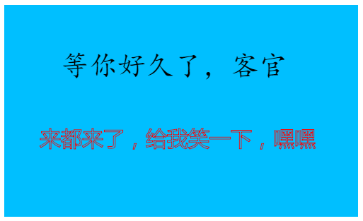
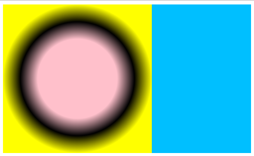

# 贼简单的canvas教程

#### 1.canvas简介(可略过)


```
  canvas是HTML5带给我们的功能强大的标签，默认为内联元素，默认大小为300×150,背景透明。
  结合JS能够实现很多炫酷的动画效果，较之于CSS3动画都有很突出的优势， 下面就让我们一起
  学习一下吧！！！
```

#### 2.canvas引入，设置canvas大小，背景颜色
```html
1>   <body>
2>      <canvas id="can" ></canvas>    //canvas引入
3>      <script type="text/javascript">
4>         var canvas=document.getElementById('can');  //获取canvas
5>         canvas.height=300;      //设置canvas高度
6>         canvas.width=500;       //设置canvas宽度
7>         canvas.style.backgroundColor='deepskyblue';  //设置canvas背景色
8>     </script>
9>   </body>
```
> **效果图**


#### 3.在canvas上创建一个2d的画板，用于后续在上边画画，你懂得。

```js
8>        var ctx=canvas.getContext('2d');  //获取2d画布
```

#### 4.大干一场之 ————  先画一个矩形
>实心矩形大小   `fillRect` ( `起始x坐标` ，`[起始y坐标]` , `矩形的宽` , `矩形的高 ` )；  
>实心矩形颜色  `fillStyle`='`颜色`'；  
>空心矩形大小  `strokeRect` ( `起始x坐标` ，`[起始y坐标]` , `矩形的宽` , `矩形的高 ` )；   
空心矩形颜色  `strokeStyle`='`颜色`'；

> **不BB,来一波实际操作**

```js
9>        //空心矩形
10>       ctx.strokeStyle='deeppink';         //空心矩形颜色
11>       ctx.strokeRect(100,50,300,200);     //空心矩形大小
```


```js
12>       //实心矩形
13>       ctx.fillStyle='black';           //实心矩形颜色
14>       ctx.fillRect(150,100,200,100);   //实心矩形大小
```


>空心矩形线宽  `lineWidth`='`数值`'

```js
9>        //空心矩形
10>       ctx.strokeStyle='deeppink';    //空心矩形颜色
11>       ctx.lineWidth='10';            //空心矩形线宽
12>       ctx.strokeRect(100,50,300,200);     //空心矩形大小  
```


#### 5.大干之第二场 ———— 画线段
>线段起始点   `moveTo` ( `起始X坐标`，`起始Y坐标` );  
>线段终止点   `lineTo` ( `终止X坐标`，`终止Y坐标` );   
>线段颜色     `strokeStyle` = `颜色`;  
>线段粗细     `lineWidth` = '`数值`';  
>线段两端样式  `lineCap` = ' `butt` || `square` || `round` ';    //效果骚年自已预览  
>画线方法      `stroke()`  
>填充方法      `fill()`


>**坑一波操作**


```js
//画一个粗粗的线段
9>       ctx.moveTo(20,20);      //设置起始点
10>	  ctx.lineTo(200,200);    //设置终止点
11>	  ctx.strokeStyle='cadetblue';  //设置线段颜色
12>	  ctx.lineWidth='20'            //设置线段粗细
13>      ctx.lineCap="square";         //设置线段两端样式
14>      ctx.stroke();           //画线
```


```js
//画一个空心三角形
9>             ctx.moveTo(50,50);    //起始点
10>			ctx.lineTo(300,50);   //终止点
11>			ctx.lineTo(175,100);  //终止点
12>			ctx.lineTo(50,50);    //终止点
13>			ctx.strokeStyle='brown';  //画线颜色
14>			ctx.lineWidth='10';   //线宽
15>			ctx.lineCap='round';  //两端样式
16>			ctx.stroke();         //画线方法
```


```js
//画一个实心三角形
9>             ctx.moveTo(50,50);    //起始点
10>			ctx.lineTo(300,50);   //终止点
11>			ctx.lineTo(175,100);  //终止点
12>			ctx.lineTo(50,50);    //终止点
13>			ctx.fillStyle='brown';  //填充颜色
14>            ctx.fill();  //填充方法
```


#### 6.画一个圆，准备起飞

>起笔 `beginPath()`  
>画圆 `arc` ( `圆心X坐标` , `圆心Y坐标` ,  `圆半径` , `画圆起始` , `画圆终止` )    
>收笔 `closePath()`  

>**小编不BB，实例来说话**

```js
//画一个实心圆
9>     ctx.beginPath();   //起笔
10>    ctx.arc(150,150,100,0,Math.PI*2);  //画圆
11>    ctx.closePath();   //收笔
12>    ctx.fillStyle='deeppink';         //填充颜色
13>    ctx.fill();        //填充方法
```


>**都画圆了，不来个弧？？？好好好，这就来了，瞧好吧**

```js
//画一个弧线
9>     ctx.beginPath();     //起笔
10>    ctx.arc(150,150,100,0,Math.PI);  //画弧,注意此时画了半个圆
11>    ctx.strokeStyle='greenyellow';  //弧颜色
12>    ctx.stroke();        //画线
13>    ctx.closePath();     //收笔

```


####  7.先老实写点文字

>`font` = ' `字体大小`  `字体风格` ';  
>`fillText` ( '`所写内容`' ，`字体X位置` , `字体Y位置` );

>**客官进来看看**

```js
//写一段实心字体
9>        ctx.font="40px 楷体";    //字体样式
10>       ctx.fillText("等你好久了，客官",80,100)  //书写字体
//写一段空心字体
11>       ctx.font="30px 微软雅黑";               //字体样式
12>       ctx.strokeStyle='red'                  //字体颜色
13>       ctx.strokeText('来都来了，给我笑一下，嘿嘿',50,200)   //书写字体

```


#### 8.终结时刻 ————  放大招(其实是渐变颜色)
>`创建线性渐变`  `createLinearGradient` ( `渐变开始X`, `渐变开始Y` , `渐变结束X` , ` 渐变结束Y `);  
>`设置颜色` `addColorStop`;( `stop` , `color` ) `stop在0~1之间取值`  `color为颜色`；


>**没搞懂，那就来个实例操作一下呗**

```js
9>       var grd=ctx.createLinearGradient(0,0,200,200);  //定义线性渐变
10>      grd.addColorStop(0,'pink');    //线性渐变开始颜色
11>      grd.addColorStop(0.5,'black')  //线性渐变中间颜色
12>      grd.addColorStop(1,'yellow');  //线性渐变结束颜色
13>      ctx.fillStyle=grd;             //填充颜色为渐变色
14>      ctx.fillRect(0,0,200,200);     //画一个实心矩形
```


>`创建径向渐变`  `createRadialGradient` ( `开始圆的X坐标` , `开始圆的Y坐标` , `开始圆的半径` , `结束圆的X坐标` ， `结束圆的Y坐标` ， `结束圆的半径` );   
>`设置颜色` `addColorStop`;( `stop` , `color` ) `stop在0~1之间取值`  `color为颜色`

>**这小编，说那么多，快来例子！！！OK,这就来**

```js
9>       var rad=ctx.createRadialGradient(150,150,80,150,150,150);  //定义径向渐变
10>      rad.addColorStop(0,'pink');    //渐变开始色
11>      rad.addColorStop(0.5,'black')  //渐变中间色
12>      rad.addColorStop(1,'yellow');  //渐变结束色
13>      ctx.fillStyle=rad;    //填充颜色
14>      ctx.fillRect(0,0,300,300);     //画一个正方形
```


#### 无聊的一笔
